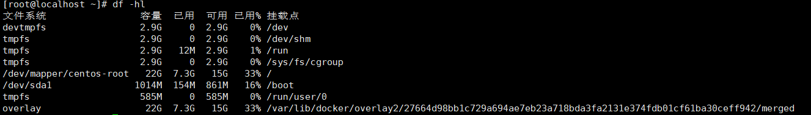
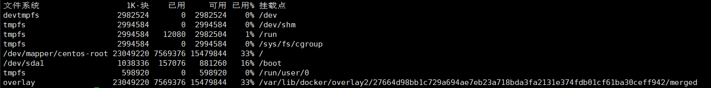
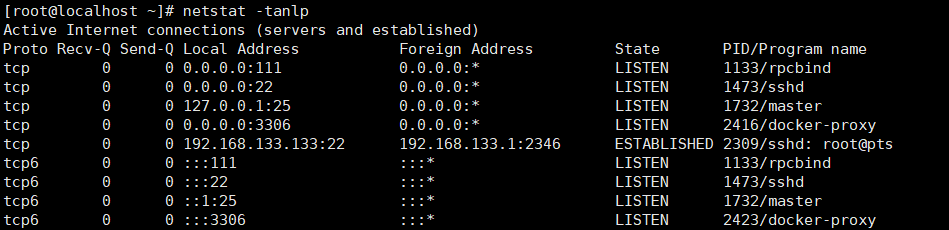
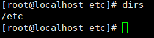
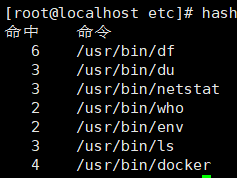
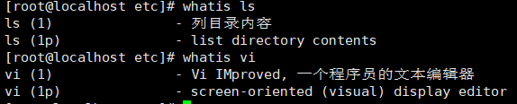

###### 绝对路径用什么符号表示？当前目录、上层目录用什么表示？主目录用什么表示? 切换目录用什么命令？    
 
绝对路径： 如/etc/init.d  
当前目录和上层目录： ./ …/  
主目录： ~/  
切换目录： cd  

###### 怎么查看当前进程？怎么执行退出？怎么查看当前路径？    

查看当前进程： ps  
执行退出： exit  
查看当前路径： pwd  

###### 怎么清屏？怎么退出当前命令？怎么执行睡眠？怎么查看当前用户 id？查看指定帮助用什么命令？    

清屏： clear  
退出当前命令： ctrl+c 彻底退出  
执行睡眠 ： ctrl+z 挂起当前进程fg 恢复后台  
查看当前用户 id： ”id“：查看显示目前登陆账户的 uid 和 gid 及所属分组及用户名  
查看指定帮助： 如 man adduser 这个很全 而且有例子；   
adduser --help 这个告诉你一些常用参数； info adduesr；    

###### Ls 命令执行什么功能？ 可以带哪些参数，有什么区别？  

ls 执行的功能： 列出指定目录中的目录，以及文件  
哪些参数以及区别： a 所有文件l 详细信息，包括大小字节数，可读可写可执行的权限等  

###### 建立软链接(快捷方式)，以及硬链接的命令。  
 
软链接： ln -s slink source  (source是我们为链接取的自定义名字)  
硬链接： ln link source   

###### 目录创建用什么命令？创建文件用什么命令？复制文件用什么命令？  

创建目录： mkdir  
创建文件：典型的如 touch，vi 也可以创建文件，其实只要向一个不存在的文件输出，都会创建文件  
复制文件： cp 7. 文件权限修改用什么命令？格式是怎么样的？   
文件权限修改： chmod  
格式如下：  
  
```𝑐ℎ𝑚𝑜𝑑𝑢+𝑥𝑓𝑖𝑙𝑒 给𝑓𝑖𝑙𝑒的属主增加执行权限  ```
chmod 751 file 给 file 的属主分配读、写、执行(7)的权限，给 file 的所在组分配读、执行(5)的权限，给其他用户分配执行(1)的权限  
𝑐ℎ𝑚𝑜𝑑𝑢=𝑟𝑤𝑥,𝑔=𝑟𝑥,𝑜=𝑥𝑓𝑖𝑙𝑒上例的另一种形式 chmod =r file 为所有用户分配读权限    
𝑐ℎ𝑚𝑜𝑑444𝑓𝑖𝑙𝑒同上例     
chmod a-wx,a+r file同上例     
$ chmod -R u+r directory 递归地给 directory 目录下所有文件和子目录的属主分配读的权限    

###### 查看文件内容有哪些命令可以使用？

vi 文件名 #编辑方式查看，可修改   
cat 文件名 #显示全部文件内容    
more 文件名 #分页显示文件内容   
less 文件名 #与 more 相似，更好的是可以往前翻页   
tail 文件名 #仅查看尾部，还可以指定行数    
head 文件名 #仅查看头部,还可以指定行数    

###### 写文件命令？怎么向屏幕输出带空格的字符串，比如”hello world”?  

写文件命令：vi,vim  
向屏幕输出带空格的字符串:echo hello world  

###### 终端是哪个文件夹下的哪个文件？黑洞文件是哪个文件夹下的哪个命令？  

终端 /dev/tty  

黑洞文件 /dev/null  

###### 移动文件用哪个命令？改名用哪个命令？
mv  
mv  

###### 复制文件用哪个命令？如果需要连同文件夹一块复制呢？

cp   
cp -r (-r表示递归执行,把文件夹里面的所有文件都复制了)  

###### 删除文件用哪个命令？如果需要连目录及目录下文件一块删除呢？删除空文件夹用什么命令？

rm   
rm -r   
rmdir  

###### Linux 下命令有哪几种可使用的通配符？分别代表什么含义?

“？”可替代单个字符。  

“*”可替代任意多个字符。  

方括号“[charset]”可替代 charset 集中的任何单个字符，如[a-z]，[abABC]  

###### 用什么命令对一个文件的内容进行统计？(字节数、行号、字数)   
wc 命令 - c 统计字节数 - l 统计行数 - w 统计字数。

###### Grep 命令有什么用？ 如何忽略大小写？ 如何查找不含该串的行?

是一种强大的文本搜索工具，它能使用正则表达式搜索文本，并把匹 配的行打印出来。  
grep [stringSTRING] filename grep [^string] filename   

######  Linux 中进程有哪几种状态？在 ps 显示出来的信息中，分别用什么符号表示的？
```
（1）、不可中断状态：进程处于睡眠状态，但是此刻进程是不可中断的。不可中断， 指进程不响应异步信号。  
（2）、暂停状态/跟踪状态：向进程发送一个 SIGSTOP 信号，它就会因响应该信号 而进入 TASK_STOPPED 状态;当进程正在被跟踪时，它处于 TASK_TRACED 这个特殊的状态。  
“正在被跟踪”指的是进程暂停下来，等待跟踪它的进程对它进行操作。  

（3）、就绪状态：在 run_queue 队列里的状态  

（4）、运行状态：在 run_queue 队列里的状态  
（5）、可中断睡眠状态：处于这个状态的进程因为等待某某事件的发生（比如等待 socket 连接、等待信号量），而被挂起  
（6）、zombie 状态（僵尸）：父亲没有通过 wait 系列的系统调用会顺便将子进程的尸体（task_struct）也释放掉  
（7）、退出状态  
```

``
D 不可中断 Uninterruptible（usually IO）  
R 正在运行，或在队列中的进程  
S 处于休眠状态  
T 停止或被追踪  
Z 僵尸进程  
W 进入内存交换（从内核 2.6 开始无效）  
X 死掉的进程  
``
###### 怎么使一个命令在后台运行?

一般都是使用 & 在命令结尾来让程序自动运行。(命令后可以不追加空格)

###### 利用 ps 怎么显示所有的进程? 怎么利用 ps 查看指定进程的信息？
ps -ef (system v 输出)   

ps -aux bsd 格式输出  

ps -ef | grep pid  

###### 哪个命令专门用来查看后台任务?
jobs -l  

###### 把后台任务调到前台执行使用什么命令?把停下的后台任务在后台执行起来用什么命令?
把后台任务调到前台执行 fg  

把停下的后台任务在后台执行起来 bg  

###### 终止进程用什么命令? 带什么参数?
kill

``
-l信号  ，通常是使用 -l信号，比如-9  ,单纯使用-l参数会列出全部的信号名称  
-a 当处理当前进程时，不限制命令名和进程号对应的关系    
-p 只打印相关进程号，而不发送任何编号   
-s 指定发送信号   
-u 指定用户  
``

kill -15 pid  只是通知对应的进程要安全干净的退出，程序接到信号后，一般会进行一些准备工作比如资源释放，临时文件删除   
kill -9 pid  强制删除   
kill命令默认的信号就是15   
其实想要在Linux中终止一个进程有两种方式，如果是前台进程可以用ctrl + c，如果是后台则使用kill    

###### 怎么查看系统支持的所有信号？
kill -l  

###### 搜索文件用什么命令? 格式是怎么样的?
find <指定目录> <指定条件> <指定动作>  

whereis 加参数与文件名  

locate 只加文件名  

find 直接搜索磁盘，较慢。
在/home下查找所有以 .txt 结尾的文件： find /home -name “*.txt"  
在/home下查找不是以 .txt 结尾的文件：find /home ! -name ".txt"  
###### 查看当前谁在使用该主机用什么命令? 查找自己所在的终端信息用什么命令?

查找自己所在的终端信息：who am i  

查看当前谁在使用该主机：who  

###### 使用什么命令查看用过的命令列表?
history   

###### 使用什么命令查看磁盘使用空间？ 空闲空间呢?  
df -hl  
   

df   
  
###### 使用什么命令查看网络是否连通? 
netstat   

netstat -tanlp  直接使用ip地址列出所有处理监听状态的TCP端口,且加上程序名输出   
  

###### 使用什么命令查看 ip 地址及接口信息？

ifconfig   

###### 查看各类环境变量用什么命令?
查看所有 env  
查看某个，如 home： env $HOME  

###### 通过什么命令指定命令提示符?
```
\u：显示当前用户账号
\h：显示当前主机名
\W：只显示当前路径最后一个目录
\w：显示当前绝对路径（当前用户目录会以~代替）
$PWD：显示当前全路径
：显示命令行’'或者’#'符号
#：下达的第几个命令
\d：代表日期，格式为week day month date，例如：“MonAug1”
\t：显示时间为24小时格式，如：HH：MM：SS
\T：显示时间为12小时格式
\A：显示时间为24小时格式：HH：MM
\v：BASH的版本信息 如export PS1=’[\u@\h\w#]$‘
```
###### 查找命令的可执行文件是去哪查找的? 怎么对其进行设置及添加?

whereis [-bfmsu][-B <目录>…][-M <目录>…][-S <目录>…][文件…]   

补充说明：whereis 指令会在特定目录中查找符合条件的文件。这些文件的应属于原始代码，二进制文件，或是帮助文件。  
```
-b 只查找二进制文件。
-B<目录> 只在设置的目录下查找二进制文件。 -f 不显示文件名前的路径名称。
-m 只查找说明文件。
-M<目录> 只在设置的目录下查找说明文件。 -s 只查找原始代码文件。
-S<目录> 只在设置的目录下查找原始代码文件。 -u 查找不包含指定类型的文件。
which 指令会在 PATH 变量指定的路径中，搜索某个系统命令的位置，并且返回第一个搜索结果。
-n 指定文件名长度，指定的长度必须大于或等于所有文件中最长的文件名。
-p 与-n 参数相同，但此处的包括了文件的路径。 -w 指定输出时栏位的宽度。
-V 显示版本信息
```
###### 通过什么命令查找执行命令?

which 只能查可执行文件  

whereis 只能查二进制文件、说明文档，源文件等  

###### 怎么对命令进行取别名？

alias la=‘ls -a’

###### du 和 df 的定义，以及区别？

du 显示目录或文件的大小  

df 显示每个<文件>所在的文件系统的信息，默认是显示所有文件系统。  

（文件系统分配其中的一些磁盘块用来记录它自身的一些数据，如 i 节点，磁盘分布图，间接块，超级块等。这些数据对大多数用户级的程序来说是不可见的，通常称为 Meta Data。）   
du 命令是用户级的程序，它不考虑 Meta Data，而 df 命令则查看文件系统的磁盘分配图并考虑 Meta Data。  
df 命令获得真正的文件系统数据，而 du 命令只查看文件系统的部分情况。   

###### 如果一个linux新手想要知道当前系统支持的所有命令的列表，他需要怎么做？
使用命令compgen -c，可以打印出所有支持的命令列表。 

###### 如果你的助手想要打印出当前的目录栈，你会建议他怎么做？
dirs  
  

###### 你的系统目前有许多正在运行的任务，在不重启机器的条件下，有什么方法可以把所有正在运行的进程移除呢？
disown -r   

###### bash shell 中的hash 命令有什么作用？
linux命令hash管理着一个内置的哈希表，记录了已执行过的命令的完整路径, 用该命令可以打印出你所使用过的命令以及执行的次数。    
  
###### 哪一个bash内置命令能够进行数学运算。
bash shell 的内置命令let 可以进行整型数的数学运算。  
```
#! /bin/bash
…
…
let c=a+b
…
…
```

###### 怎样一页一页地查看一个大文件的内容呢？
```cat file_name.txt | more```

###### 数据字典属于哪一个用户的？
数据字典是属于’SYS’用户的，用户‘SYS’ 和 ’SYSEM’是由系统默认自动创建的  

###### 怎样查看一个linux命令的概要与用法？假设你在/bin目录中偶然看到一个你从没见过的的命令，怎样才能知道它的作用和用法呢？

使用命令whatis 可以先出显示出这个命令的用法简要  
  
